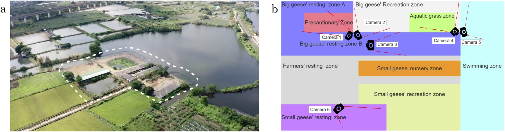
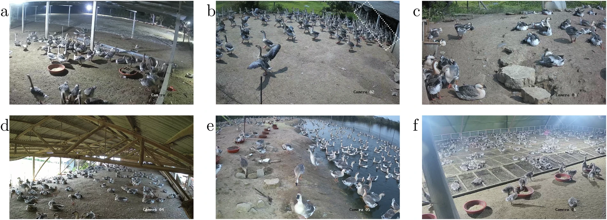
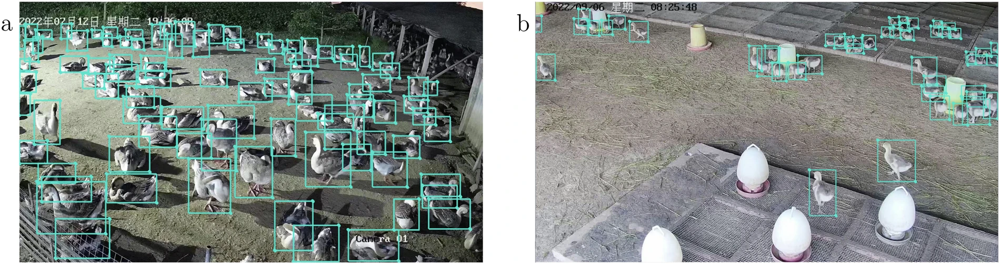
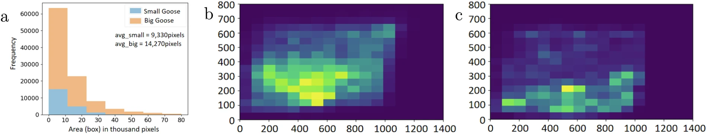
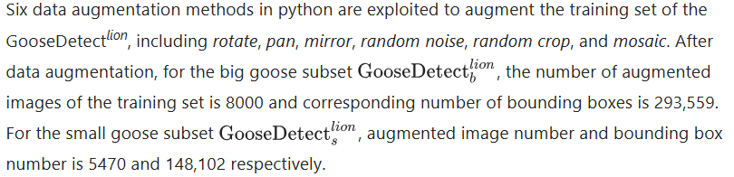
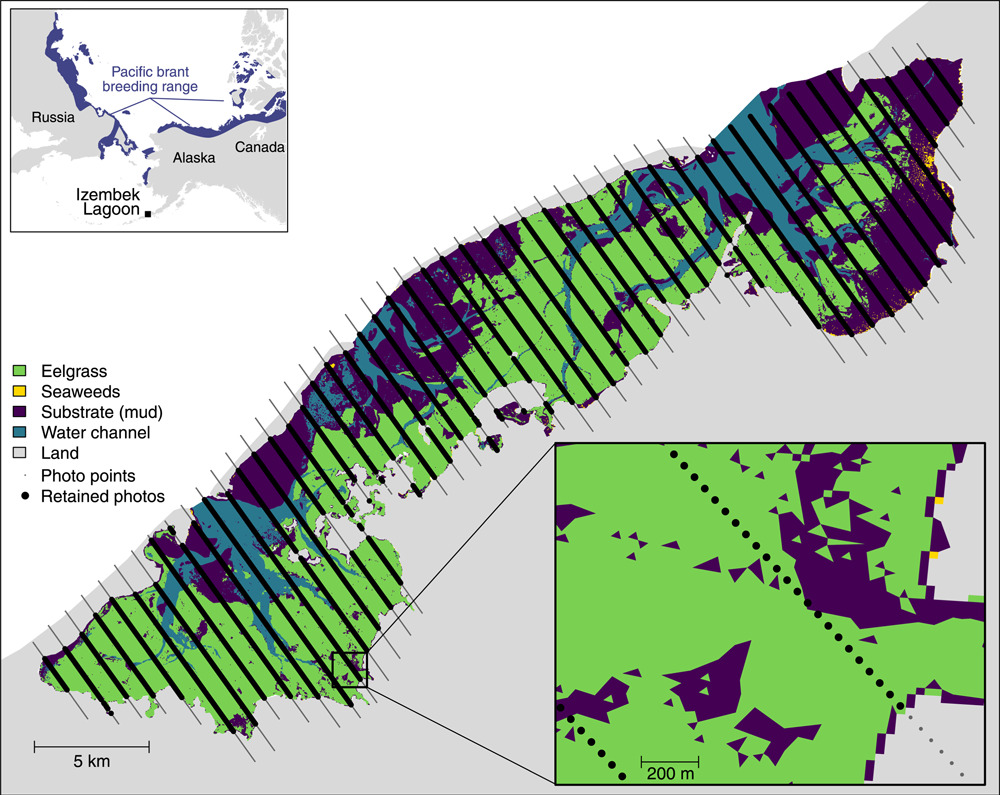

# Notes from shared articles and repositories

---

[toc]

I note some useful viewpoints from the articles in case I don't forget where they're from.

##  Article-GooseDetectlion: A Fully Annotated Dataset for Lion-head Goose Detection in Smart Farms

```typescript
@article{Feng2024,
  title = {GooseDetectlion: A Fully Annotated Dataset for Lion-head Goose Detection in Smart Farms},
  volume = {11},
  ISSN = {2052-4463},
  url = {http://dx.doi.org/10.1038/s41597-024-03776-1},
  DOI = {10.1038/s41597-024-03776-1},
  number = {1},
  journal = {Scientific Data},
  publisher = {Springer Science and Business Media LLC},
  author = {Feng,  Yuhong and Li,  Wen and Guo,  Yuhang and Wang,  Yifeng and Tang,  Shengjun and Yuan,  Yichen and Shen,  Linlin},
  year = {2024},
  month = sep 
}
```

> In farming environments, geese are often densely packed, which makes them prone to mutual occlusion, background clutter and pose diversity. 

> 

The image indicating camera location is bit schematic.

> 

> Images are randomly selected from each video as long as they meet the following condition: the number of the big geese on each image was larger than 30, or that of the small geese on each image was larger than 50. In addition, the final number of images from each camera is lager than 200, which guarantees the diversity.

> Finally, we obtain a collection with 2000 images of big geese and 660 images of small geese. In all, the dataset is characteristic of good generalization since it contain images under different weather conditions and different illuminations:
>
> - Have different illuminations since they are sampled from whole day videos, including morning, noon, afternoon and evening.
> - Cover different seasons since images of big geese are sampled from videos collected in summer, i.e., July, and small ones are sampled from videos collected in winter, i.e., November.
> - Cover varied weather conditions, including thunderstorm, sunny and cloudy. For example, we choose images of big geese sampled from videos collected on July 9 and July 10, since it was thunderstorm in July 9 and cloudy in July 10.

`characteristic of good generalization` was mentioned in the text although the data collection steps can't strongly support this.

> A hand-annotated dataset. Around fifty volunteers participated in the labelling under the guidance of an experienced mentor throughout the whole annotation process.

> First, in pre-processing, following geese are identified and removed:
>
> 1. Geese far away from the cameras, e.g. those in the dotted area in Fig. 2b, which are too vague, due to the luminance and cameras’ resolution;
> 2. Geese with obscuration rate larger than 70%, where obscuration rate refers to the proportion of visible body over entire body. As aforementioned, the goose farm is a dense farming environment, lots of geese are obscurated by others.

> 

> Average Number of Boxes per Image: 36.88

> 
>
> 


## Article-Optimizing surveys of fall-staging geese using aerial imagery and automated counting

```typescript
@article{Weiser2022,
  title = {Optimizing surveys of fall‐staging geese using aerial imagery and automated counting},
  volume = {47},
  ISSN = {2328-5540},
  url = {http://dx.doi.org/10.1002/wsb.1407},
  DOI = {10.1002/wsb.1407},
  number = {1},
  journal = {Wildlife Society Bulletin},
  publisher = {Wiley},
  author = {Weiser,  Emily L. and Flint,  Paul L. and Marks,  Dennis K. and Shults,  Brad S. and Wilson,  Heather M. and Thompson,  Sarah J. and Fischer,  Julian B.},
  year = {2022},
  month = dec 
}
```

> Ocular aerial surveys allow efficient coverage of large areas and can be used to monitor abundance and distribution of wild populations. However, uncertainty around resulting population estimates can be large due to difficulty in visually identifying and counting animals from aircraft, as well as logistical challenges in estimating detection probabilities. Photographic aerial surveys can mitigate these challenges and can allow flight at higher altitudes to minimize disturbance of birds and improve safety for surveyors. 

The introduction mostly discusses how photogrammetry is more effective and precise than human eye.

> 

` Photos taken at the large black points were over open water and retained for analysis (N = 5,649 photo trigger points).` Many photos.

Then extensive description of the data collection process.


## Repo-[Izembek Brant Goose Detector](https://github.com/agentmorris/usgs-geese?tab=readme-ov-file#izembek-brant-goose-detector)

```typescript
@misc{https://doi.org/10.5066/p9uhp1le,
  doi = {10.5066/P9UHP1LE},
  url = {https://www.sciencebase.gov/catalog/item/62438853d34e21f8275ffd67},
  author = {{Emily L Weiser} and {Paul L Flint} and {Dennis K. Marks} and {Brad S. Shults} and {Heather M. Wilson} and {Sarah J. Thompson} and {Julian B. Fischer}},
  keywords = {alaska,  coastal ecosystems,  population dynamics,  photography,  wetland ecosystems,  aquatic ecosystems,  birds,  wildlife,  waterfowl,  aerial photography,  izembek national wildlife refuge,  migratory birds,  migratory species,  estuarine habitat,  aerial surveys,  ducks/geese/swans,  branta bernicla,  alaska peninsula,  animals/vertebrates,  tundra ecosystems,  relative abundance analysis,  image collections,  waders/gulls/auks and allies,  izembek lagoon,  branta hutchinsii,  anser canagicus},
  title = {Aerial Photo Imagery from Fall Waterfowl Surveys,  Izembek Lagoon,  Alaska,  2017-2019},
  publisher = {U.S. Geological Survey},
  year = {2022},
  copyright = {Creative Commons Zero v1.0 Universal}
}
```

> There are around 100,000 training images, about 95% of which contain no geese. Images are 8688 x 5792. 
